# 实验环境搭建

> 基于 Ubuntu 16.04

## 1.Ubuntu 16.04 安装
下载 Ubuntu 镜像源之后，直接安装即可，VMware 会自动检测到 Ubuntu 然后傻瓜式安装。

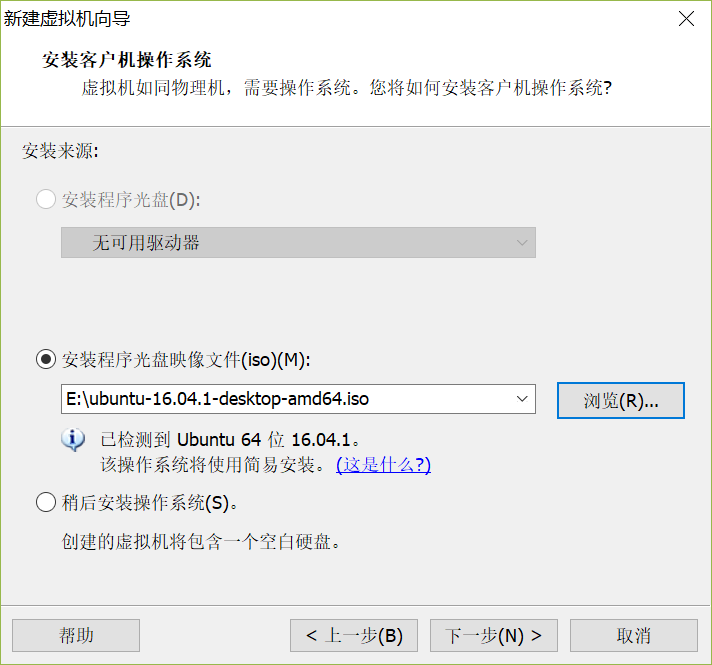

分配25G硬盘（应该够了），并存储为单个文件

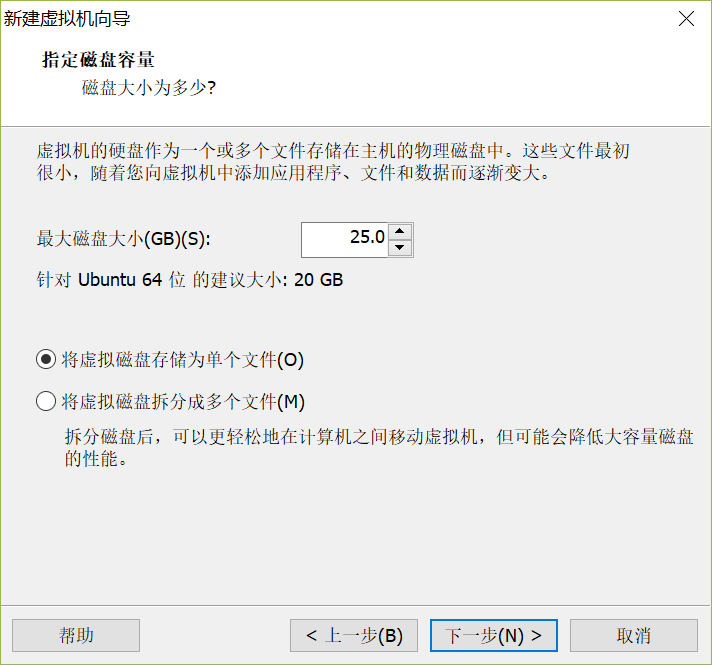

分配两个G内存：

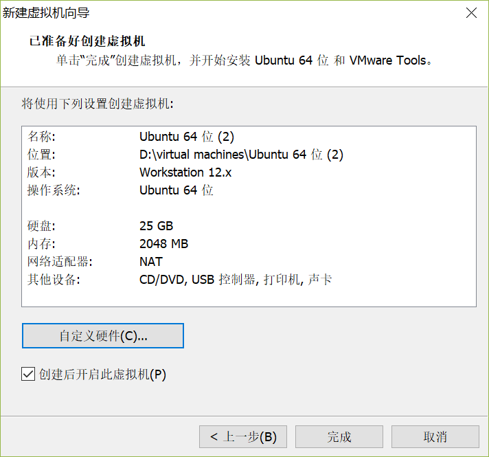

点击完成即可自动安装。

## 2.更改源
Ubuntu 的软件源配置文件是 /etc/apt/sources.list。将系统自带的该文件做个备份。可以使用命令：
```
cp /etc/apt/sources.list /etc/apt/sources.list.bak
```

然后修改 sources.list 文件内容，改为如下内容：(可以使用 vim)
```
# 默认注释了源码镜像以提高 apt update 速度，如有需要可自行取消注释
deb https://mirrors.tuna.tsinghua.edu.cn/ubuntu/ xenial main restricted universe multiverse
# deb-src https://mirrors.tuna.tsinghua.edu.cn/ubuntu/ xenial main restricted universe multiverse
deb https://mirrors.tuna.tsinghua.edu.cn/ubuntu/ xenial-updates main restricted universe multiverse
# deb-src https://mirrors.tuna.tsinghua.edu.cn/ubuntu/ xenial-updates main restricted universe multiverse
deb https://mirrors.tuna.tsinghua.edu.cn/ubuntu/ xenial-backports main restricted universe multiverse
# deb-src https://mirrors.tuna.tsinghua.edu.cn/ubuntu/ xenial-backports main restricted universe multiverse
deb https://mirrors.tuna.tsinghua.edu.cn/ubuntu/ xenial-security main restricted universe multiverse
# deb-src https://mirrors.tuna.tsinghua.edu.cn/ubuntu/ xenial-security main restricted universe multiverse

# 预发布软件源，不建议启用
# deb https://mirrors.tuna.tsinghua.edu.cn/ubuntu/ xenial-proposed main restricted universe multiverse
# deb-src https://mirrors.tuna.tsinghua.edu.cn/ubuntu/ xenial-proposed main restricted universe multiverse
```

[参考清华镜像源帮助文档](https://mirrors.tuna.tsinghua.edu.cn/help/ubuntu/)

之后，使用如下命令更新源(可能会花点时间)：
```
apt-get update
```

## 3.安装部分软件
使用 apt-get install 命令,现在就想到一个 git 要用，之后需要什么安装什么。
```
sudo apt-get install git
```

gcc, g++, gdb, make 等工具 Ubuntu 自带，不用安装。

如下，编译32位程序出错，需安装 gcc-multilib
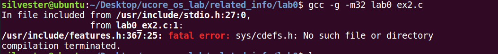

```
sudo apt-get install gcc-multilib
```

## 4.安装 VS code IDE
在firefox浏览器中打开 vscode 官网首页，然后下载 .deb 文件

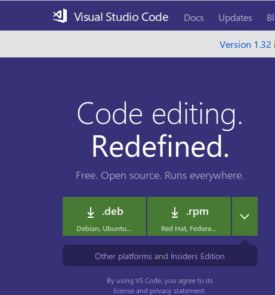

进入下载的 .deb 文件目录（/home/username/Downloads）然后使用如下命令安装该文件，**注意换文件名**
```
sudo dpkg -i filename.deb
```
如果出差错，使用 sudo apt-get install -f 修复。

再执行 sudo dpkg -i filename.deb 即可。

然后在软件管理中心（左上角那个图标）搜索 VS code 即可搜到。 

## 5.将 git 连接至 GitHub，并配置 SSH
#### （1） 创建ssh密钥
```
ssh-keygen -t rsa -C "youremail@example.com"
```
邮箱是你注册github邮箱，一路回车.

#### （2）进入 .ssh 目录，如果是普通用户，就在用户目录下，root 用户在 /root 目录下。

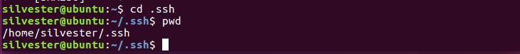

该文件夹下有两个文件，复制 id_rsa.pub 文件内容。进入 github setting 界面，添加 SSH key，将刚才复制内如粘贴至如下：

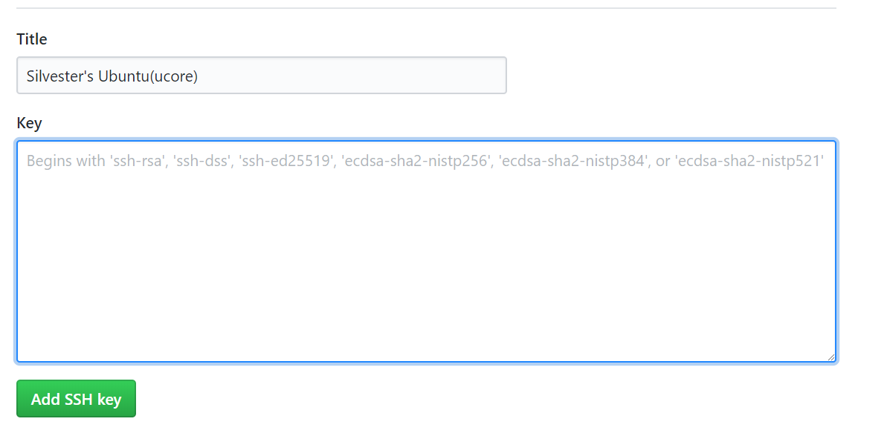

然后就可以随意使用git 来操作远程的github仓库了。测试如下：

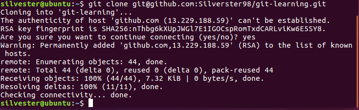

## 6.安装 qemu
下载源码：(源码版本可以在官网找到 [qemu 官网](https://www.qemu.org/download/#source))

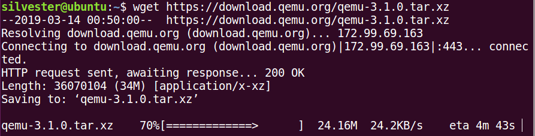

解压进入：
```
tar xvJf qemu-3.1.0.tar.xz
cd qemu-3.1.0
```

安装依赖编译并编译安装:
```
sudo apt-get install libsdl1.2-dev libpixman-1-dev bison flex
./configure --target-list="i386-softmmu"
make
sudo make install
```

./configure --help 可以查看安装配置，此处仅安装 x86_32 硬件环境。

然后在 /src/local/bin 目录下可以看到装好的 qemu：
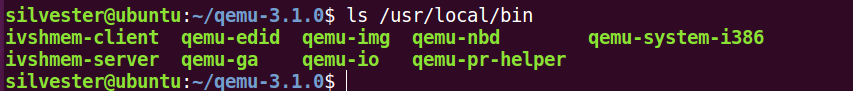

建立符号链接文件 qemu
```
cd /usr/local/bin
sudo ln -s qemu-system-i386 qemu
```
这样你可以直接输入 qemu 执行，而不是 qemu-system-i386

键入 qemu 测试，可以发现 qemu 界面出现。

## 7.搜狗输入法安装（可选）
主要用来写代码时写注释，当然你也可以选择写英文注释。。。

进入搜狗输入法官网，下载 linux 版本的 .deb 文件，即安装包。

进入下载目录执行如下命令安装：
```
sudo dpkg -i sogoupinyin_2.2.0.0108_amd64.deb
```

在软件管理中心找到 language support:

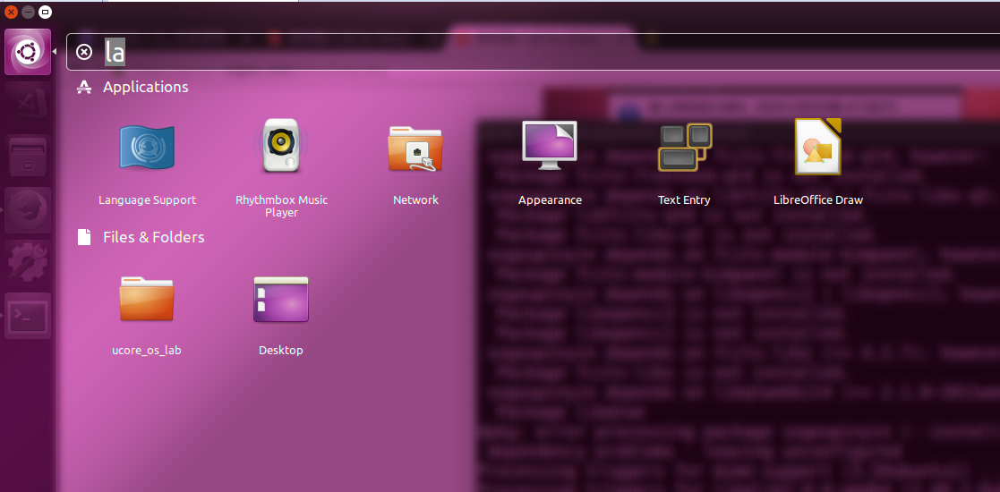

打开(可能报错)：

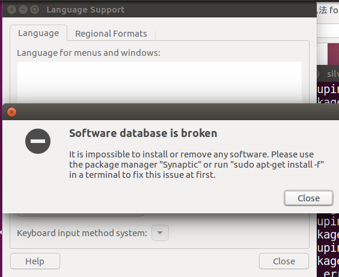

输入如下命令修复：
```
sudo apt-get install -f 
```
重新打开:

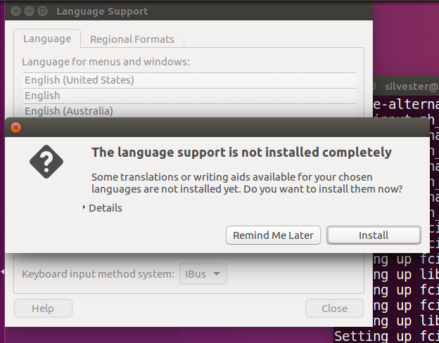

点击 install,安装完出现如下界面，把系统键盘输入方式 IBus 改为 fcitx:

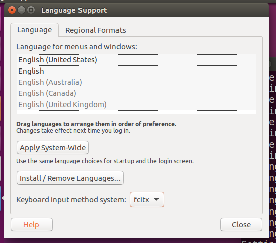

Close 然后重启虚拟机，右上角点键盘图标。

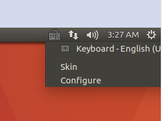

点击 configure.

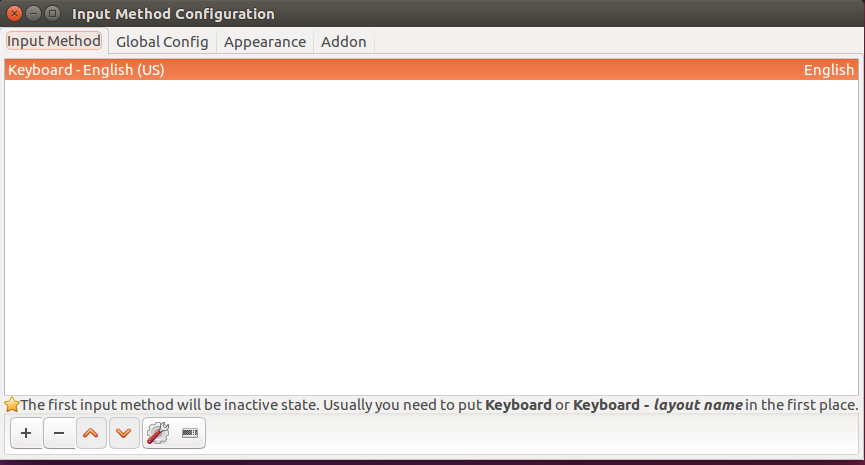

点击左下角 + 号，将Only show current language 选项去掉，然后搜 so,上方出现 Sogou Pinyin，选择它，点击 OK.

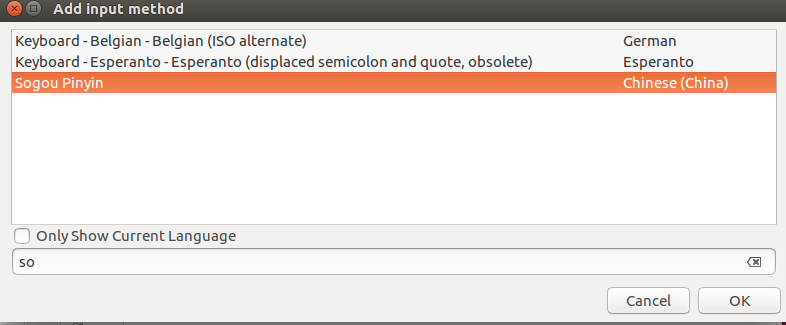

打开浏览器试一下（shift 切换输入法）可以看到输入法安装成功。


