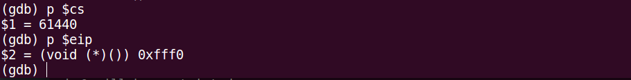
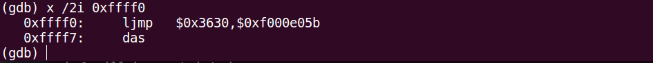
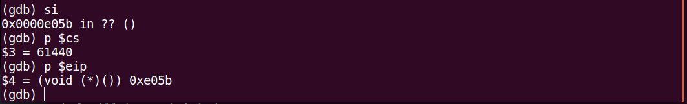
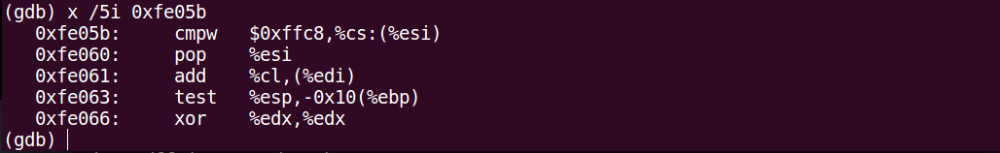
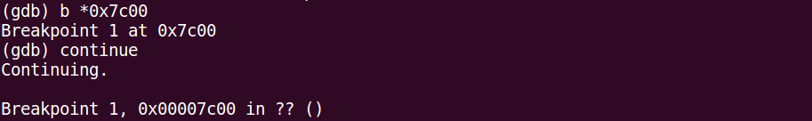
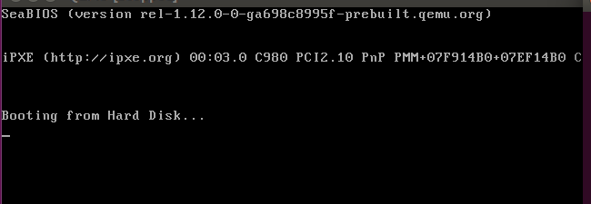
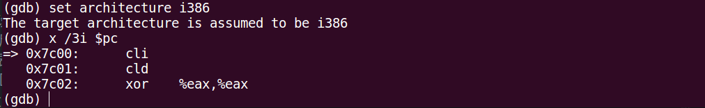
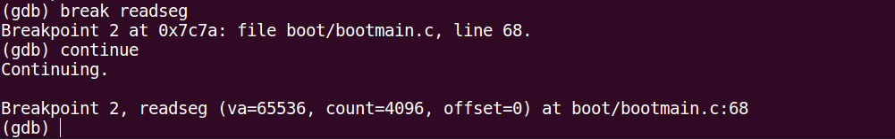

# lab1-practice2

> practice2 基于 lab1-answer 完成

## 练习2.1答案
make lab1-mon 解析：
```
$(V)$(TERMINAL) -e "$(QEMU) -S -s -d in_asm -D $(BINDIR)/q.log -monitor stdio -hda $< -serial null"
$(V)sleep 2
$(V)$(TERMINAL) -e "gdb -q -x tools/lab1init"
```

第一行翻译：gnome-terminal -e "qemu-system-i386 -S -s -d in_asm -D bin/q.log -monitor stdio -hda bin/ucore.img -serial null"

第三行翻译：在文件中执行gdb 命令，该文件为 tools/labinit,内容如下：
```
# labinit

file bin/kernel # 指定调试目标文件
target remote :1234 # 远程调试
set architecture i8086 # 设置使用架构
b *0x7c00 # 设断点
continue # 继续运行
x /2i $pc # 显示当前 pc 后两条指令 
```

make debug 解析：
```
$(V)$(QEMU) -S -s -parallel stdio -hda $< -serial null &
$(V)sleep 2
$(V)$(TERMINAL)  -e "cgdb -q -x tools/gdbinit"
```

第一行翻译：当前窗口执行qemu
第三行翻译：重新开一个terminal进行cgdb 调试，它引用的是 gdbinit 文件中的命令

#### 单步跟踪BIOS的执行
修改 gdbinit 中的文件内容为：
```
set architecture i8086
target remote :1234
```

这样，通过调用 make debug 命令，启动 qemu 并连接 gdb,但是此时 qemu 是停止在第一条指令的。 

然后过程如下：



查看当前 cs eip 寄存器值，cs = 61440 = 0xf000,eip = 0xfff0。这两个寄存器在实模式下构成一个地址，即0xffff0,这也是bios执行的第一条指令（这是一条跳转指令）。



可以查看到与当前指令向邻近的若干条指令（此处相邻是指地址上相邻而不是执行顺序）。



然后使用 si 命令执行下一条，则 cs 和 eip 寄存器都做出相关改变。



同样可以查看到跟当前指令相邻的若干条指令。

## 练习2.2答案
接着练习2.1继续调试：



设置断点 0x7c00,并继续执行。0x7c00是 bootloader 所在内存地址的起始地址。



可以看到 qemu 界面在加载完 bios 之后也会打印字符。



由于加载 bootloader 之后会进入保护模式，此处更改架构为 i386。同时显示 bootloader 的前三条指令。

## 练习2.3答案
恢复 gdbinit 原来内容：
```
file obj/bootblock.o
target remote :1234
break bootmain
continue
```

修改 make debug 命令：
```
debug: $(UCOREIMG)
	$(V)$(QEMU) -S -s -d in_asm -D q.log -parallel stdio -hda $< -serial null &
	$(V)sleep 2
	$(V)$(TERMINAL)  -e "cgdb -q -x tools/gdbinit"
```
即第一行添加了 qemu 的参数： -d in_asm -D q.log 这个是在 gdb 执行过程中将运行指令保存到 q.log

在 q.log 中找到 0x00007c00 地址开始的指令即 bootloader 开始的指令（q.log中的内容很多，用IDE查找功能找一下）
```
IN: 
0x00007c00:  fa                       cli      
0x00007c01:  fc                       cld      
0x00007c02:  31 c0                    xorw     %ax, %ax
0x00007c04:  8e d8                    movw     %ax, %ds
0x00007c06:  8e c0                    movw     %ax, %es
0x00007c08:  8e d0                    movw     %ax, %ss

----------------
IN: 
0x00007c0a:  e4 64                    inb      $0x64, %al

----------------
IN: 
0x00007c0c:  a8 02                    testb    $2, %al
0x00007c0e:  75 fa                    jne      0x7c0a

----------------
IN: 
0x00007c10:  b0 d1                    movb     $0xd1, %al
0x00007c12:  e6 64                    outb     %al, $0x64
0x00007c14:  e4 64                    inb      $0x64, %al
0x00007c16:  a8 02                    testb    $2, %al
0x00007c18:  75 fa                    jne      0x7c14

----------------
IN: 
0x00007c1a:  b0 df                    movb     $0xdf, %al
0x00007c1c:  e6 60                    outb     %al, $0x60
0x00007c1e:  0f 01 16 6c 7c           lgdtw    0x7c6c
0x00007c23:  0f 20 c0                 movl     %cr0, %eax
0x00007c26:  66 83 c8 01              orl      $1, %eax
0x00007c2a:  0f 22 c0                 movl     %eax, %cr0

----------------
IN: 
0x00007c2d:  ea 32 7c 08 00           ljmpw    $0x8:$0x7c32

----------------
IN: 
0x00007c32:  66 b8 10 00              movw     $0x10, %ax
0x00007c36:  8e d8                    movl     %eax, %ds

----------------
IN: 
0x00007c38:  8e c0                    movl     %eax, %es

----------------
IN: 
0x00007c3a:  8e e0                    movl     %eax, %fs
0x00007c3c:  8e e8                    movl     %eax, %gs
0x00007c3e:  8e d0                    movl     %eax, %ss

----------------
IN: 
0x00007c40:  bd 00 00 00 00           movl     $0, %ebp

----------------
IN: 
0x00007c45:  bc 00 7c 00 00           movl     $0x7c00, %esp
0x00007c4a:  e8 c0 00 00 00           calll    0x7d0f

----------------
IN: 
0x00007d0f:  a1                       .byte    0xa1

```

以上代码就是bootloader 开始执行后到调用 bootmain 之前的代码。 同时可以发现，以上代码在 bootasm.S 中有定义。

## 练习2.4答案
就随便设置一个断点就行

