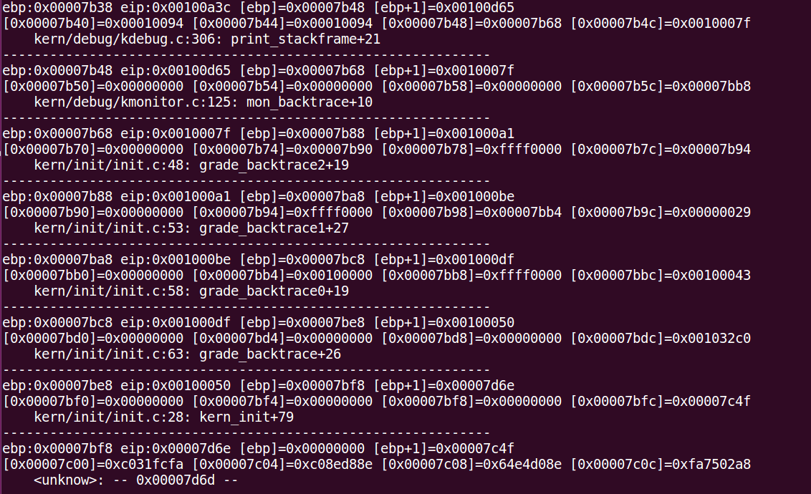

# lab1-practice5

## 堆栈结构
```
|----地址-----|----内容----|-----说明------|
| 0x00007c00 | start 地址 | bootloader的第一条指令(cli)
| 0x00007bfc | 0x00007c4f | 
| 0x00007bf8 | 0x00000000 | last ebp (unknow func（bootmain 函数）)
| 0x00007bf4 | 0x00000000 | 参二
| 0x00007bf0 | 0x00000000 | 参一
| 0x00007bec | 0x00007d6e | 
| 0x00007be8 | 0x00007bf8 | last ebp (kern_init)
| 0x00007be4 |
| 0x00007be0 |
| 0x00007bdc | 
| 0x00007bd8 |
| 0x00007bd4 |
| 0x00007bd0 |
| 0x00007bcc | 0x00100050 | 
| 0x00007bc8 | 0x00007be8 | last ebp (grade_backtrace)
| 0x00007bc4 |
| 0x00007bc0 |
| 0x00007bbc |
| 0x00007bb8 |
| 0x00007bb4 |
| 0x00007bb0 |
| 0x00007bac |
| 0x00007ba8 | 0x00007bc8 | last ebp (grade_backtrace0)
| 0x00007ba4 |
| 0x00007ba0 |
| 0x00007b9c |
| 0x00007b98 |
| 0x00007b94 |
| 0x00007b90 |
| 0x00007b8c |
| 0x00007b88 | 0x00007ba8 | last ebp (grade_backtrace1)
| 0x00007b84 |
| 0x00007b80 |
| 0x00007b7c |
| 0x00007b78 |
| 0x00007b74 |
| 0x00007b70 |
| 0x00007b6c |
| 0x00007b68 | 0x00007b88 | last ebp (grade_backtrace2)
| 0x00007b64 |
| 0x00007b60 | 
| 0x00007b5c | 0x00007bb8 |
| 0x00007b58 | 0x00000000 |
| 0x00007b54 | 0x00000000 | 
| 0x00007b50 | 0x00000000 | 参1
| 0x00007b4c | 0x0010007f |
| 0x00007b48 | 0x00007b68 | last ebp (mon_backtrace)
| 0x00007b44 | 0x00010094 | 参2
| 0x00007b40 | 0x00010094 | 参1
| 0x00007b3c | 0x00100d65 | 
| 0x00007b38 | 0x00007b48 | last ebp (print_stackframe)
| 0x00007b34 |
| 0x00007b30 |
```

具体 print_stackframe 输出结果：


## print_stackframe 代码:
```
void
print_stackframe(void) {
     /* LAB1 YOUR CODE : STEP 1 */
     /* (1) call read_ebp() to get the value of ebp. the type is (uint32_t);
      * (2) call read_eip() to get the value of eip. the type is (uint32_t);
      * (3) from 0 .. STACKFRAME_DEPTH
      *    (3.1) printf value of ebp, eip
      *    (3.2) (uint32_t)calling arguments [0..4] = the contents in address (uint32_t)ebp +2 [0..4]
      *    (3.3) cprintf("\n");
      *    (3.4) call print_debuginfo(eip-1) to print the C calling function name and line number, etc.
      *    (3.5) popup a calling stackframe
      *           NOTICE: the calling funciton's return addr eip  = ss:[ebp+4]
      *                   the calling funciton's ebp = ss:[ebp]
      */
    uint32_t ebp = read_ebp();
    uint32_t eip = read_eip();

    int i, j;
    for (i = 0; ebp != 0; i++) {
        // first eip is unknown
        cprintf("ebp:0x%08x eip:0x%08x [ebp]=0x%08x [ebp+1]=0x%08x\n", ebp, eip, ((uint32_t *)ebp)[0], ((uint32_t *)ebp)[1]);
        
        uint32_t *args = (uint32_t *)ebp + 2; // get arg1's address
        for (j = 0; j < 4; j++) {
            cprintf("[0x%08x]=0x%08x ",args + j, args[j]);
        }
        cprintf("\n");
        print_debuginfo(eip - 1);

        eip = ((uint32_t *)ebp)[1];
        ebp = ((uint32_t *)ebp)[0];
        cprintf("--------------------------------------------------------------\n");
    }
}
```

从以上输出结果来看，参数的个数是可以变化的。总体来说，函数堆栈就是当调用子程序时，需要把传入子程序的参数返回地址等信息压入堆栈，让函数可以一级一级的调用。

ss:ebp 所指向的是堆栈的一个地址，这个地址的内容是 caller 的ebp.

ss:ebp+4 是caller 调用时的 eip,相当于给出返回地址。