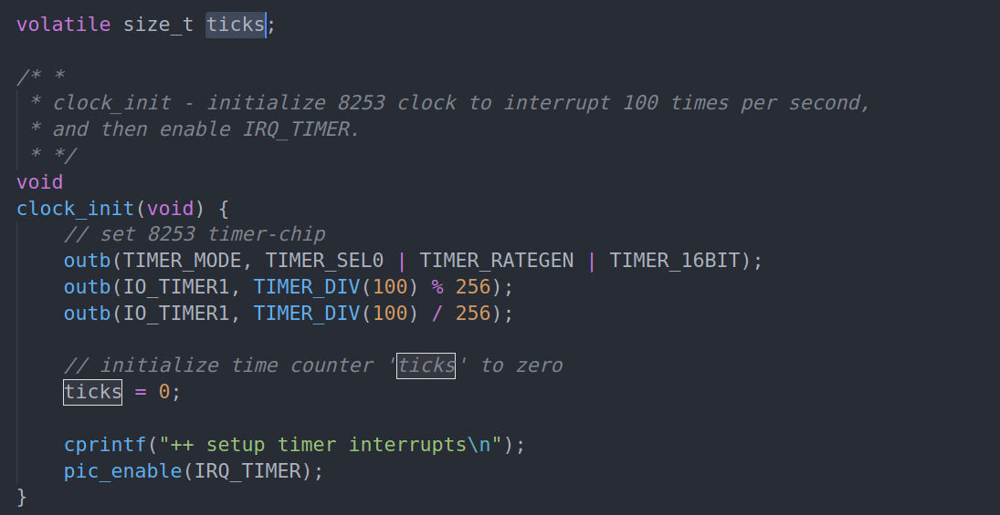
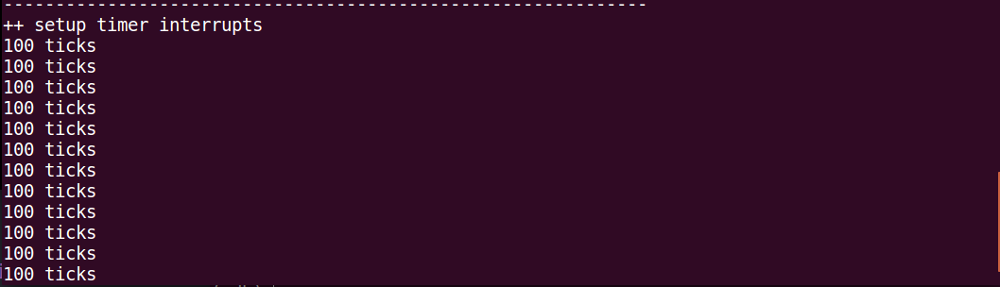

# lab1-practice6

## 中断描述符表项构成
```
|31--------------------------------------------------0|
|------------------- offset 15-0 ---------------------|
|------------------ selector 15-0 --------------------|
| P |  DPL |S=0|TYPE(4 bit)|-- 000 --|-- 参数计数值 ---|
|------------------ offset 31-16 ---------------------|
```

## idt_init()
```
void
idt_init(void) {
     /* LAB1 YOUR CODE : STEP 2 */
     /* (1) Where are the entry addrs of each Interrupt Service Routine (ISR)?
      *     All ISR's entry addrs are stored in __vectors. where is uintptr_t __vectors[] ?
      *     __vectors[] is in kern/trap/vector.S which is produced by tools/vector.c
      *     (try "make" command in lab1, then you will find vector.S in kern/trap DIR)
      *     You can use  "extern uintptr_t __vectors[];" to define this extern variable which will be used later.
      * (2) Now you should setup the entries of ISR in Interrupt Description Table (IDT).
      *     Can you see idt[256] in this file? Yes, it's IDT! you can use SETGATE macro to setup each item of IDT
      * (3) After setup the contents of IDT, you will let CPU know where is the IDT by using 'lidt' instruction.
      *     You don't know the meaning of this instruction? just google it! and check the libs/x86.h to know more.
      *     Notice: the argument of lidt is idt_pd. try to find it!
      */
    extern uintptr_t __vectors[]; // use extern vectors defined in vectors.S
    int i;
    for (i = 0; i < 256; i++) { // set 256 interrupt GATE
        SETGATE(idt[i], 0, GD_KTEXT, __vectors[i], DPL_KERNEL);
    }
    lidt(&idt_pd); // load IDTR
}
```

SETGATE(gate, istrap, sel, off, dpl) 函数详解：
- gate: 描述符表项，第i个描述符就是 idt[i]
- istrap: 是否是 trap 类型
- sel: 选择子，就是1，即全局描述符中的第一个选择子
- off: 偏移，即中断向量的地址在内存中的偏移
- dpl: dpl值，在内核的话就是0（DPL_KERNEL）

**lidt() 注意传入的参数是 idtr 在内存中定义的地址。**

## trap_dispatch()
```
    case IRQ_OFFSET + IRQ_TIMER:
        /* LAB1 YOUR CODE : STEP 3 */
        /* handle the timer interrupt */
        /* (1) After a timer interrupt, you should record this event using a global variable (increase it), such as ticks in kern/driver/clock.c
         * (2) Every TICK_NUM cycle, you can print some info using a funciton, such as print_ticks().
         * (3) Too Simple? Yes, I think so!
         */
        ticks++;
        if (ticks % 100 == 0) {
            print_ticks();
            ticks = 0;
        }
        break;
```
对于时钟中断，我们的目的是每100次时钟中断打印一次 ‘100 ticks’ 字符串，那么需要有一个全局变量 count 来记录，然后到100就打印，在对 count 记0.

在 clock_init() 阶段，函数中有一个对变量 ticks 赋值0的操作，那么可以想到，这个全局变量就是我们记录时钟中断的变量。



至此，代码已补全，使用 make debug 命令会进行调试然后显示 时钟中断输出的 ‘100 ticks’ 字符串

