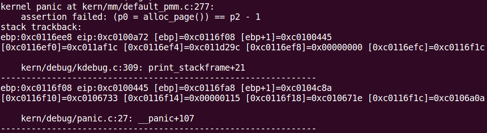
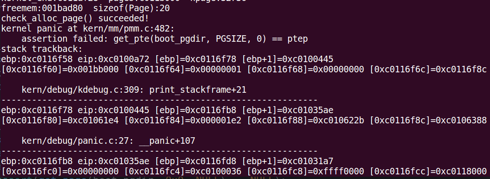
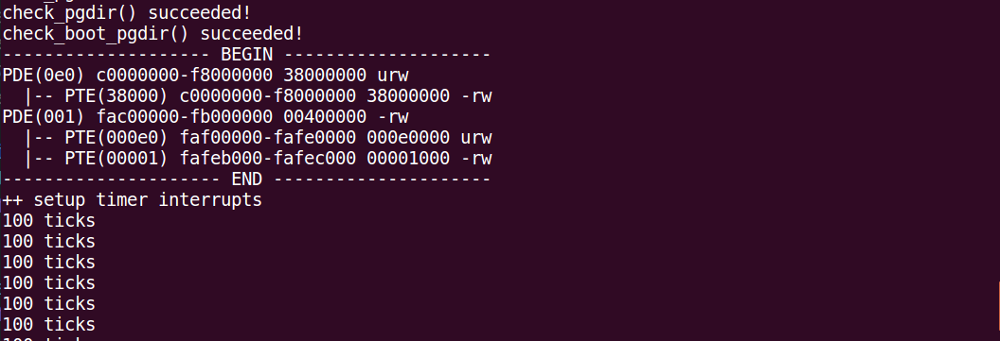

# 物理内存管理

## pmm_init()
关键函数调用栈：
```
| - pmm_init
| --- boot_cr3 = PADDR(boot_pgdir); // 获取页目录表地址，也是存放在cr3里的
| --- init_pmm_manager  // 初始化physical memory manager，初始化free_area 数据结构
| --- page_init // 主要初始化对物理内存的管理，包括设置数据结构 Page 等。
| ------ *
| ------ default_init_memmap // 这是 pmm_manager 的 default_init_memmap，是对空闲非保留可用的空闲页的Page管理数据结构进行初始化，包括设置 flag,properity。以及对第一个Page的不同设置。最后将其加入 free_area.free_list
| ------ *
| --- check_alloc_page(); // 这个函数在未修改代码时调用会报错。。（kernel panic at kern/mm/default_pmm.c:277:），这样一行代码出错，是由于 alloc_page 原始实现出错。主要原因是在申请页和释放页时所得到的一些空闲页没有有序的加入free_list,导致空闲页列表不是一个有序的列表。
```

原始代码运行报错：



自内核后的内存区域：
```
|-------------- maxpa
|-------------- ROUNDDOWN(maxpa), end of freemem
|- free memary, 真实可用部分，属于未保留可用部分内存
|-------------- ROUNDUP(freemem)
|-------------- freemem
|- Page 管理数据结构区域，属于保留部分
|-------------- ROUNDUP(kernel end), pages
|-------------- kernel end
```

## default_pmm.c 代码修改,即实现 first fit 算法
正如前面提到的：**check_alloc_page(); 这个函数在未修改代码时调用会报错。。（kernel panic at kern/mm/default_pmm.c:277:），这样一行代码出错，是由于 alloc_page 和 free_page 的原始实现出错。主要原因是在申请页和释放页时所得到的一些空闲页没有 *有序* 的加入free_list,导致空闲页列表不是一个 *有序* 的列表。**

**按照空闲块地址增加的顺序形成一个链表**

下面修改 default_free_pages() 函数 和 default_alloc_pages()

default_free_pages()
```
static void
default_free_pages(struct Page *base, size_t n) {
    assert(n > 0);
    struct Page *p = base;
    for (; p != base + n; p ++) {
        assert(!PageReserved(p) && !PageProperty(p));
        p->flags = 0;
        set_page_ref(p, 0);
    }
    base->property = n;
    SetPageProperty(base);
    list_entry_t *le = list_next(&free_list);
    while (le != &free_list) {
        p = le2page(le, page_link);
        le = list_next(le);
        if (base + base->property == p) {
            base->property += p->property;
            ClearPageProperty(p);
            list_del(&(p->page_link));
        }
        else if (p + p->property == base) {
            p->property += base->property;
            ClearPageProperty(base);
            base = p;
            list_del(&(p->page_link));
        }
    }
    nr_free += n;
    // add code
    // 需要找到第一个地址比base大的空闲块，然后插在他的前面
    le = list_next(&free_list);
    while (le != &free_list) {
        p = le2page(le, page_link);
        if (base + base->property <= p) {
            break;
        }
        le = list_next(le);
    }
    list_add_before(le, &(base->page_link));
}
```

default_alloc_pages()
```
static struct Page *
default_alloc_pages(size_t n) {
    assert(n > 0);
    if (n > nr_free) {
        return NULL;
    }
    struct Page *page = NULL;
    list_entry_t *le = &free_list;
    while ((le = list_next(le)) != &free_list) {
        struct Page *p = le2page(le, page_link);
        if (p->property >= n) {
            page = p;
            break;
        }
    }
    if (page != NULL) {
        // list_del(&(page->page_link));
        // 把多余的空闲块插入此空闲块后，然后再删除此空闲块
        if (page->property > n) {
            struct Page *p = page + n;
            p->property = page->property - n;
            list_add_after(&(page->page_link), &(p->page_link));
            SetPageProperty(p);
        }
        list_del(&(page->page_link));
        nr_free -= n;
        ClearPageProperty(page);
    }
    return page;
}
```

更改完以上代码之后再次运行：



可以看到 check_alloc_page() 已经校验完成，说明页面的分配与释放按照 first fit 算法已经实现完毕。但是，在后面的校验中有报错，说明还有其他方面问题：kernel panic at kern/mm/pmm.c:482:，该行代码是 check_pgdir(void)。

## page_init() 函数解析
```
static void
page_init(void) {
    struct e820map *memmap = (struct e820map *)(0x8000 + KERNBASE);
    uint64_t maxpa = 0;

    cprintf("e820map:\n");
    int i;
    for (i = 0; i < memmap->nr_map; i ++) { # 打印系统中的RAM,ROM区域
        uint64_t begin = memmap->map[i].addr, end = begin + memmap->map[i].size;
        cprintf("  memory: %08llx, [%08llx, %08llx], type = %d.\n",
                memmap->map[i].size, begin, end - 1, memmap->map[i].type);
        if (memmap->map[i].type == E820_ARM) {
            if (maxpa < end && begin < KMEMSIZE) {
                maxpa = end;
            }
        }
    }
    cprintf("maxpa:%08llx\n", maxpa);
    if (maxpa > KMEMSIZE) {
        maxpa = KMEMSIZE;
    }

    extern char end[]; // 0xc011af28,内核结束地址（随内核代码改变）

    npage = maxpa / PGSIZE;
    pages = (struct Page *)ROUNDUP((void *)end, PGSIZE); // 管理内存的Page数据结构起始地址
    cprintf("kernel_end:%08lx  pages:%08lx  npage:%d\n", end, pages, npage); // kernel_end:c011af28  pages:c011b000  npage:32736

    for (i = 0; i < npage; i ++) {
        SetPageReserved(pages + i);  // 所有物理页均设为保留（for kernel）
    }

    uintptr_t freemem = PADDR((uintptr_t)pages + sizeof(struct Page) * npage); // 空闲空间（真实可用的）
    cprintf("freemem:%08x　sizeof(Page):%d\n", freemem, sizeof(struct Page));

    for (i = 0; i < memmap->nr_map; i ++) {
        uint64_t begin = memmap->map[i].addr, end = begin + memmap->map[i].size;
        if (memmap->map[i].type == E820_ARM) {
            if (begin < freemem) {
                begin = freemem;
            }
            if (end > KMEMSIZE) {
                end = KMEMSIZE;
            }
            if (begin < end) {
                begin = ROUNDUP(begin, PGSIZE); // 真实空闲区起始，一般是ROUNDUP(freemem)
                end = ROUNDDOWN(end, PGSIZE); // 一般就是ROUNDDOWN(maxpa)
                if (begin < end) {
                    init_memmap(pa2page(begin), (end - begin) / PGSIZE); // 对真实空闲区对应的Page数据结构初始化
                }
            }
        }
    }
}
```

## 实现寻找虚拟地址对应的页表项
get_pte() 函数补充，此函数是传入 page directory 的地址 pgdir，和一个逻辑地址 la，来获取 la 对应的页表项的地址。
```
pte_t *
get_pte(pde_t *pgdir, uintptr_t la, bool create) {
    pde_t *pdep = &pgdir[PDX(la)]; // 根据la获取页目录表中的一项
    if (!(*pdep & PTE_P)) { // 判断是否存在这一项，存在就返回这一项地址，不存在新建一项
        struct Page *page;
        // 申请一页作为页表，对应页目录项是　*pdep
        if (!create || (page = alloc_page()) == NULL) { // 不分配或分配页失败
            return NULL;
        }
        set_page_ref(page, 1); // 设置页引用为１
        uintptr_t pa = page2pa(page); // 获取该物理页对应的物理地址
        memset(KADDR(pa), 0, PGSIZE); // 转化为物理内核虚地址，并清空页内容
        *pdep = pa | PTE_U | PTE_W | PTE_P; // 设置该项地址属性
    }
    return &((pte_t *)KADDR(PDE_ADDR(*pdep)))[PTX(la)]; // 取出页表中对应的该项，是在新申请的页中，是没有内容的。
}
```

页表项和页目录项解析：
```
|----------------------------------------------------|
31                    12 11   9 8 7 6 5 4 3  2   1  0
|     base address      |  AVL |0|0|D|A|0|0|U/S|R/W|P|
```

- base address 是该页表或页对应的基地址
- P 存在位，表示是否存在物理内存中
- R/W 读写位，判读是否可读写
- U/S 用户管理员位，用来指明普通用户是否可以访问
- A 访问标志，记录是否访问过该页
- D 写入位，记录是否对该页有过写操作
- AVL 保留，操作系统可以使用

## 释放某虚地址所在的页并取消对应二级页表项的映射
page_remove_pte() 函数补充
```
static inline void
page_remove_pte(pde_t *pgdir, uintptr_t la, pte_t *ptep) {
    if (!(*ptep & PTE_P)) {
        cprintf("ERROR: block associated with ptep doesn't exist");
    } else {
        struct Page *page = pte2page(*ptep);
        if (page_ref_dec(page) == 0) { // 当引用为0，即释放该物理页
            free_page(page);
        }
        *ptep = 0; // 该映射清除
        tlb_invalidate(pgdir, la);
    }
}
```

以上代码添加完毕之后再次运行：



可以发现 check_pgdir() succeed！同时时钟中断调用也成功。

## page_insert 函数解析
```
//page_insert - build the map of phy addr of an Page with the linear addr la
// paramemters:
//  pgdir: the kernel virtual base address of PDT
//  page:  the Page which need to map
//  la:    the linear address need to map
//  perm:  the permission of this Page which is setted in related pte
// return value: always 0
//note: PT is changed, so the TLB need to be invalidate 
int
page_insert(pde_t *pgdir, struct Page *page, uintptr_t la, uint32_t perm) {
    pte_t *ptep = get_pte(pgdir, la, 1);
    if (ptep == NULL) {
        return -E_NO_MEM;
    }
    page_ref_inc(page);
    if (*ptep & PTE_P) { // 该项存在
        struct Page *p = pte2page(*ptep);
        if (p == page) { // 该Page已存在页表项中
            page_ref_dec(page);
        }
        else { // 该项被占用，需移除
            page_remove_pte(pgdir, la, ptep);
        }
    }
    *ptep = page2pa(page) | PTE_P | perm; // 页表项中插入该Page
    tlb_invalidate(pgdir, la);
    return 0;
}
```

这个函数主要的作用就是把一个物理页映射到一个线性地址，并在页表项中做记录。

比如物理地址为0x00103000地址的物理页，线性地址 0x00000033对应的页映射到该物理页，那么bit31-22是页目录表项index=0，bit21-12是页表项index=0,bit11-0是页内地址。那么对应的就在0号页目录项对应的页表的0页表项记录如下信息：0x00103xxx, 00103是高二十位，对应物理地址，xxx是低12位对应属性。


## 总结
这一部分的重点就是对Page数据结构进行管理，这个数据结构是管理物理页的数据结构。他的起始地址是内核结束地址后的第一个页的边界。他的长度是 maxpa/PGSIZE*sizeof(struct Page)。Page数据结构后的第一个页就是真实可用的内存区域的起始地址。

然后就是页机制的建立。首先根据页目录的基址(boot_pgdir)确定页目录表，有了页目录表就可以确定页表，页表确定即可确定页表项，根据页表项就能找到对应的Page及该Page对应的物理内存的地址。整个页机制的几个主要函数有get_pte()--获取逻辑地址对应的页表项, page_remove_pte()--移除la对应的页表项, page_insert()--将一个物理页映射到虚拟地址，就是添加页表项。

注：自映射机制没看懂
