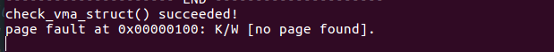
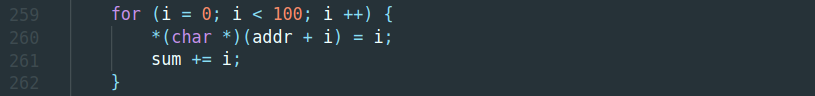
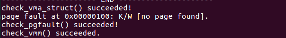
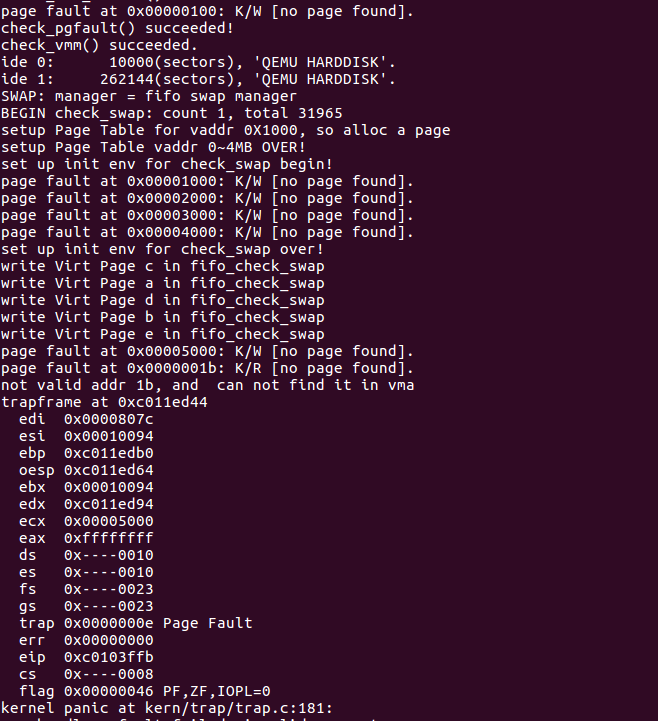
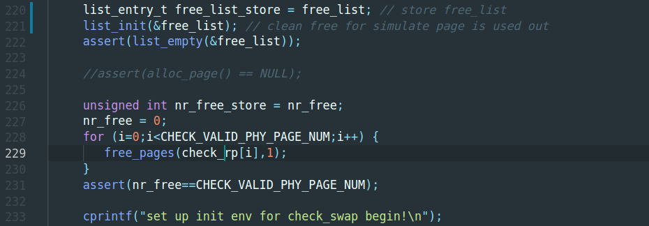
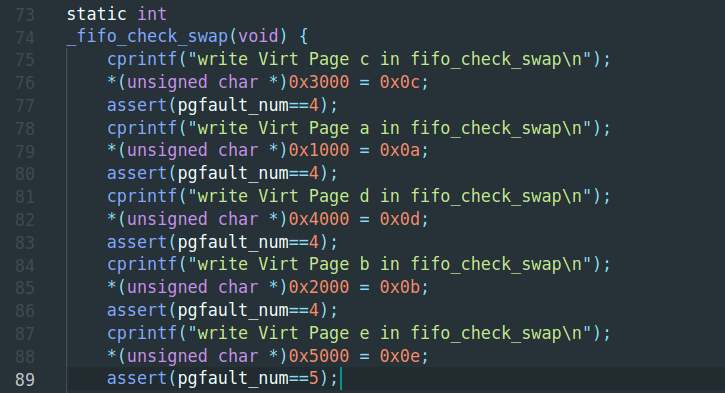
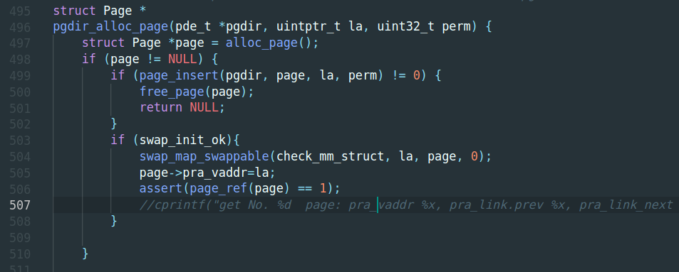
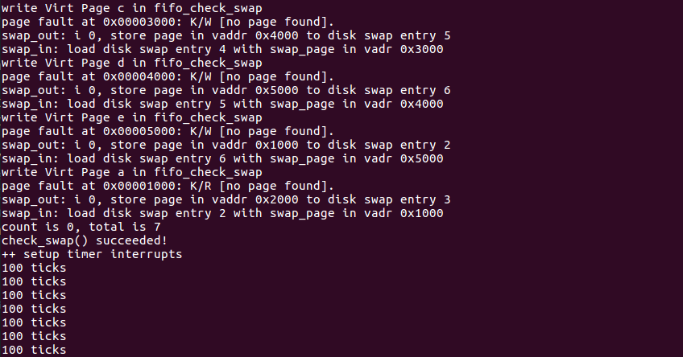

# 虚拟内存管理

## 练习1：给未被映射的地址映射上物理页
这个练习需要写代码完成 do_pgfault() 函数，这个函数是处理 page fault execption

在填充 lab1 和 lab2 的代码之后，重新运行代码，代码会出现错误：



这显示了一个 page fault at 0x00000100

具体看代码：kern_init() -> vmm_init() -> check_vmm()

check_vmm()代码如下：
```
static void
check_vmm(void) {
    size_t nr_free_pages_store = nr_free_pages();
    
    check_vma_struct();
    check_pgfault();

    assert(nr_free_pages_store == nr_free_pages());

    cprintf("check_vmm() succeeded.\n");
}
```
这块代码包含两个check代码，check_vma_struct(), check_pgfault()。其中check_vma_struct() 是成功运行的，可以看到上面图片。

具体查看 check_pgfault()代码是如下代码发生异常：



这段代码直接使用0x00000100~0x00000100+100这段虚拟地址，这段地址还没有分配物理内存，因此会发生缺页异常。

异常处理过程：
> trap--> trap_dispatch-->pgfault_handler-->do_pgfault

因此，主要的处理代码是在 do_pgfault()这个函数。这个函数需要补全。如下：（包含代码解析）
```
int
do_pgfault(struct mm_struct *mm, uint32_t error_code, uintptr_t addr) {
    int ret = -E_INVAL; // -3， ret需要返回0才是处理成功
    //try to find a vma which include addr
    struct vma_struct *vma = find_vma(mm, addr);

    pgfault_num++;
    //If the addr is in the range of a mm's vma?
    if (vma == NULL || vma->vm_start > addr) {
        cprintf("not valid addr %x, and  can not find it in vma\n", addr);
        goto failed;
    }
    //check the error_code
    switch (error_code & 3) {
    default:
            /* error code flag : default is 3 ( W/R=1, P=1): write, present */
            // 默认是写一个存在地址
    case 2: // 出错原因是虚拟地址没有在内存中的对于块，该块可写
        if (!(vma->vm_flags & VM_WRITE)) { // 但如果vma标记是不可写则出错，即处理失败
            cprintf("do_pgfault failed: error code flag = write AND not present, but the addr's vma cannot write\n");
            goto failed;
        }
        break;
    case 1: // 只读且存在于内存，即本应不会报异常
        cprintf("do_pgfault failed: error code flag = read AND present\n");
        goto failed;
    case 0: // 只读且不存在于内存
        if (!(vma->vm_flags & (VM_READ | VM_EXEC))) { // 当vma标记不可读且不可执行，则本次处理失败。
            cprintf("do_pgfault failed: error code flag = read AND not present, but the addr's vma cannot read or exec\n");
            goto failed;
        }
    }
    /* IF (write an existed addr ) OR
     *    (write an non_existed addr && addr is writable) OR
     *    (read  an non_existed addr && addr is readable)
     * THEN
     *    continue process
     */
    uint32_t perm = PTE_U;
    if (vma->vm_flags & VM_WRITE) {
        perm |= PTE_W;
    }
    addr = ROUNDDOWN(addr, PGSIZE);

    ret = -E_NO_MEM;

    pte_t *ptep=NULL;
    ptep = get_pte(mm->pgdir, addr, 1); // 根据 addr 获取他的 pte
    if (ptep ==  NULL) { // get pte failed
        cprintf("get_pte falied\n");
        goto failed;
    }

    if (*ptep == 0) { // pte 没有指向一个物理页，那么就 alloc 一个
        if (pgdir_alloc_page(mm->pgdir, addr, perm) == NULL) {
            cprintf("alloc_page failed\n");
            goto failed;
        }
    } else { // pte 指向了一个物理页，说明该地址之前已经分配过物理内存，但现在还是有page_fault,说明他是被换出了
        if(swap_init_ok) { // have phy addr but need swap to load
            struct Page *page=NULL;
            // 换入
            if ((ret = swap_in(mm, addr, &page)) != 0) {
                cprintf("swap_in in do_pgfault failed\n");
                goto failed;
            }
            page_insert(mm->pgdir, page, addr, perm); // 建立映射关系
            swap_map_swappable(mm, addr, page, 1); // 设置为可交换
            page->pra_vaddr = addr;
        }
        else {
            cprintf("no swap_init_ok but ptep is %x, failed\n",*ptep);
            goto failed;
        }
    }

   ret = 0;
failed:
    return ret;
}
```

修改代码完毕，然后再次运行：



此时发生一次page fault，调用do_pgfault()之后就可以完成处理。check_pgfault()就可以成功调用那么check_vmm()也就可以成功调用。

- 总结：pg_fault根据 error_code 以及 跟addr相关联的vma数据结构来进行权限或者数据不在内存的判读，在由此来分别进行不同的处理。当发生的是缺页异常，那么就会申请一个页或者从外存调入一个页。

总结page fault原因：
- 页表项全为0，虚拟和物理映射关系撤销或还未建立映射关系
- 物理页不在内存，需要换入
- 访问权限不够

思考题1：
- 页表会保存有替换出的页在外存中存储的扇区信息
思考题2：
- 异常地址保存在CR2,交由do_pgfault()处理

## 练习2：
再次运行的时候，会发生如下错误：



这个错误是发生在 swap_init()函数中的。

swap_init()函数中的主要功能1. 调用swap_manager的init()函数，初始化swap_manager,之后对swap功能检测，check_swap()调用。swap_manager包含了对swap管理的一些实现，具体的发fifo页面置换算法在其中实现。

查看check_swap()有如下一段代码：



这段代码是将 free_list， nr_free置空，模拟空闲的物理页已经被使用完。由此来调用swap功能。

在 check_swap()中，首先是仅保留4个物理页，然后设置vma的实际可访问地址空间为 4K~24K，这就超过了4个物理页的大小，因此会有swap的调用。

在check的过程中会调用swap_manager的下面这个函数，模拟产生的缺页异常也是在这个地方触发的：



首先对a,b,c,d四个页进行访问，那么这四个虚拟页会相应的获得一个物理页，物理页就空了，再访问page 5,即0x5000时就会没有物理页，此时没有实现swap功能就会导致panic.


在处理这个缺页异常时，运行到如下代码，由于没有物理页，需要alloc一个page。因此最终关键函数在alloc_pages(),该函数定义在pmm.c

```
do_pgfault(struct mm_struct *mm, uint32_t error_code, uintptr_t addr) {
    ...
    if (*ptep == 0) { // pte doesn't have a phy addr, alloc a page
        if (pgdir_alloc_page(mm->pgdir, addr, perm) == NULL) {
            cprintf("alloc_page failed\n");
            goto failed;
        }
    } else {
    ...
}
```


```
struct Page *
alloc_pages(size_t n) {
    struct Page *page=NULL;
    bool intr_flag;
    
    while (1)
    {
         local_intr_save(intr_flag);
         {
              page = pmm_manager->alloc_pages(n);
         }
         local_intr_restore(intr_flag);

         if (page != NULL || n > 1 || swap_init_ok == 0) break;
         
         extern struct mm_struct *check_mm_struct;
         //cprintf("page %x, call swap_out in alloc_pages %d\n",page, n);
         swap_out(check_mm_struct, n, 0); // 换出一些物理页以腾出空间。
    }
    //cprintf("n %d,get page %x, No %d in alloc_pages\n",n,page,(page-pages));
    return page;
}
```

该函数会调用swap_out()来将物理页换出。swap_out()函数中会调用swap_out_victim()(即_fifo_swap_out_victim)来将物理页换出，这部分代码也是需要补全的。

```
static int
_fifo_swap_out_victim(struct mm_struct *mm, struct Page ** ptr_page, int in_tick)
{
     list_entry_t *head=(list_entry_t*) mm->sm_priv;
         assert(head != NULL);
     assert(in_tick==0);
     /* Select the victim */
     /*LAB3 EXERCISE 2: YOUR CODE*/ 
     //(1)  unlink the  earliest arrival page in front of pra_list_head qeueue
     //(2)  assign the value of *ptr_page to the addr of this page
     list_entry_t *le = head->prev; // 获取队首的页地址
     struct Page *p = le2page(le, pra_page_link);
     list_del(le); // 将该页从链表中移除
     *ptr_page = p; // 将该页地址赋给ptr_page
     return 0;
}
```

以上代码就是将 mm->sm_priv 的头元素给从fifo队列移除，相应的在swap_out() 中再free该对应页。_fifo_swap_out_victim()本身是比较简单的。

移出页之后就可以申请到物理页了，有了物理页之后，还需要将该物理页对应的list_entry_t加入到mm->sm_priv队尾。



上图中显示在alloc_page之后，会有一次调用swap_map_swappable()(即调用的_fifo_map_swappable)

```
static int
_fifo_map_swappable(struct mm_struct *mm, uintptr_t addr, struct Page *page, int swap_in)
{
    list_entry_t *head=(list_entry_t*) mm->sm_priv;
    list_entry_t *entry=&(page->pra_page_link);
 
    assert(entry != NULL && head != NULL);
    //record the page access situlation
    /*LAB3 EXERCISE 2: YOUR CODE*/ 
    //(1)link the most recent arrival page at the back of the pra_list_head qeueue.
    list_add(head, entry); // 加入链尾
    return 0;
}
```

以上代码填充完毕再次运行：



可以发现，check_swap() succeed!并且开始打印ticks.

- 总结：关于swap这一块的内容，需要填写的代码并不是很多，而且fifo替换算法也是比较好理解的。核心在于确定被换出的页，然后将换入的页加入到fifo队列。当物理内存不足时若发生请求物理内存这种情况，那么需要将当前不常用的物理内存块移至外存（即fifo队首物理页）。

思考题：
- 换出页是最先进入fifo队列即最早被调用的页，这个页位于mm->sm_priv_next,即fifo队列队首。页不在页表（虚拟地址未装入物理空间）且页表满（物理空间不足）的情况下进行换入换出。

