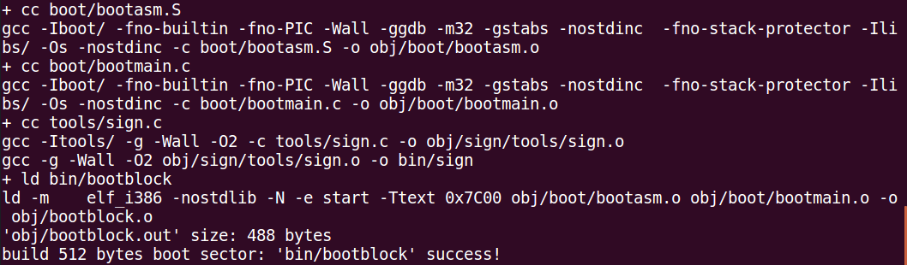

# bootloader 代码解析

项目结构：
```
.
├── boot
│   ├── asm.h
│   ├── bootasm.S
│   └── bootmain.c
├── kern
│   ├── debug
│   │   ├── assert.h
│   │   ├── kdebug.c
│   │   ├── kdebug.h
│   │   ├── kmonitor.c
│   │   ├── kmonitor.h
│   │   ├── panic.c
│   │   └── stab.h
│   ├── driver
│   │   ├── clock.c
│   │   ├── clock.h
│   │   ├── console.c
│   │   ├── console.h
│   │   ├── intr.c
│   │   ├── intr.h
│   │   ├── kbdreg.h
│   │   ├── picirq.c
│   │   └── picirq.h
│   ├── init
│   │   └── init.c
│   ├── libs
│   │   ├── readline.c
│   │   └── stdio.c
│   ├── mm
│   │   ├── memlayout.h
│   │   ├── mmu.h
│   │   ├── pmm.c
│   │   └── pmm.h
│   └── trap
│       ├── trap.c
│       ├── trapentry.S
│       ├── trap.h
│       └── vectors.S
├── libs
│   ├── defs.h
│   ├── elf.h
│   ├── error.h
│   ├── printfmt.c
│   ├── stdarg.h
│   ├── stdio.h
│   ├── string.c
│   ├── string.h
│   └── x86.h
├── Makefile
└── tools
    ├── function.mk
    ├── gdbinit
    ├── grade.sh
    ├── kernel.ld
    ├── sign.c
    └── vector.c

10 directories, 48 files
```

对实验1，我们在填完代码之后，在终端输入 make V= 即可查看整个项目编译过程。其中跟 bootloader 相关的部分如下：



可以看出，整个对于 bootblock 的生成过程，显示编译 .S,.c 文件，然后连接 然后再制作一个有 512 byte 的 bootblock.

## boot 目录解析
boot 目录下有三个文件:asm.h, bootasm.S,bootmain.c

### 1.asm.h 代码解析
```
#ifndef __BOOT_ASM_H__
#define __BOOT_ASM_H__

/* Assembler macros to create x86 segments */

/* Normal segment */
#define SEG_NULLASM                                             \  // 这一段是使用汇编语法定义了一个空段
    .word 0, 0;                                                 \  // .word = 2B .byte = 1B
    .byte 0, 0, 0, 0                                               // 这样就定义了一个8字节的内存空间即一个段

#define SEG_ASM(type,base,lim)                                  \  // 段定义宏，传入段type,base,lim即在内存空间生成一个段
    .word (((lim) >> 12) & 0xffff), ((base) & 0xffff);          \  // lim = 32bit 段描述符中lim是20位，在此取高20位存入，这时以页为单位（一般），第二个字为base 的15-0位
    .byte (((base) >> 16) & 0xff), (0x90 | (type)),             \  // base 的23-16位，10010000 | type 
        (0xC0 | (((lim) >> 28) & 0xf)), (((base) >> 24) & 0xff)    // 11000000 | lim(高4位), base 的31-24位


/* Application segment type bits */
#define STA_X       0x8     // Executable segment
#define STA_E       0x4     // Expand down (non-executable segments)
#define STA_C       0x4     // Conforming code segment (executable only)
#define STA_W       0x2     // Writeable (non-executable segments)
#define STA_R       0x2     // Readable (executable segments)
#define STA_A       0x1     // Accessed

#endif /* !__BOOT_ASM_H__ */

```

段描述符结构：
```
  7                                0
 |----------------------------------|
0|------------ lim 7-0 -------------|
1|----------- lim 15-8 -------------|
2|----------- base 7-0 -------------|
3|----------- base 15-8 ------------|
4|----------- base 23-16 -----------|
5| P |   DPL  | S |     type    | A |
6| G | D | 0  |AVL|--- lim 19-16 ---|
7|----------- base 31-24 -----------|
```

```
S=1,E=0时：
| P |   DPL  | S | E | ED | WA | A |

S=1,E=1时：
| P |   DPL  | S | E | C | R | A |

E 对应：  #define STA_X       0x8
ED 对应:  #define STA_E       0x4
WA 对应： #define STA_W       0x2
C 对应：  #define STA_C       0x4
R 对应：  #define STA_R       0x2
A 对应:   #define STA_A       0x1
```

## 2.bootasm.S 解析
```
#include <asm.h>

.set PROT_MODE_CSEG,      0x8   # 保护模式下代码段定义为第一个选择子
.set PROT_MODE_DSEG,      0x10  # 数据段定义为第二个选择子
.set CR0_PE_ON,           0x1   # CR0 PE 位置1启动保护模式

.global start
start:
.code16                         # 还是实模式下，为16位代码
    cli                         # 关中断
    cld                         # 清DF,串操作为自动增址

    xor %ax, %ax                # ax 置0
    movw %ax, %ds               # ds 置0
    movw %ax, %es               # es 置0
    movw %ax, %ss               # ss 置0
    
# 设置A20 gate
seta20.1:                       
    inb $0x64, %al              # 读0x64地址状态
    testb $0x2, %al             # 判断是否还有数据
    jnz seta20.1                # 还有数据就等待无数据

    movb $0xd1, %al
    outb %al, $0x64             # 发出写命令

seta20.2:
    inb $0x64, %al
    testb %0x2, %al
    jnz seta20.2                # 等待芯片将写命读入

    movb $0xdf, %al             # 0xdf =  1101 1111
    outb %al, $0x60             # 将 output port2 的bit1 置1


    # 加载 gdt,使用lgdt指令
    lgdt gdtdesc                # 加载gdt到gdtr
    movl %cr0, %eax             # 获取cr0值
    orl $CR0_PE_ON, %eax
    movl %eax, %cr0             # 将cr0的PE位置1，启动保护模式

    # 此时已经将cpu设置为保护模式，下面代码是在32bit 保护模式下运行
    ljmp $PROT_MODE_CSEG, $protcseg  # 一个长跳转，到cs段，protcseg偏移处的代码开始执行

.code32 # 以下是32位下的代码
protcseg:
    movw $PROT_MODE_DSEG, %ax
    movw %ax, %ds
    movw %ax, %es
    movw %ax, %fs
    movw %ax, %gs
    movw %ax, %ss               # 以上将ds寄存器的值分别存入所示的几个段寄存器

    movl $0x0, %ebp             # 设置ebp为0
    movl $start, %esp           # 将0-start的空间做堆栈
    call bootmain               # 调用bootmain主函数

# boot出错，跳出，在此循环
spin:
    jmp spin

.p2align 2                      # 内存边界对齐（好像是）
gdt:
    SEG_NULLASM                             # 第一个段描述符为空
    SET_ASM(STA_X|STA_R, 0x0, 0xffffffff)   # 第二个段描述符为代码段描述符
    SET_ASM(STA_W, 0x0, 0xffffffff)         # 第三个段描述符为数据段描述符
gdtdesc:
    .word 0x17                  # gdtr中的限长部分 (0x17+1)/8=3个段描述符
    .long gdt                   # gdt在内存中的地址

```

## bootmain.c 解析
```
#include <defs.h>
#include <x86.h>
#include <elf.h>


#define SECTSIZE 512
#define ELFHDR   ((struct elfhdr *)0x10000) // elfheader 在内存中的首地址定义为0x10000

static void waitdisk(void) {
    while ((inb(0x1f7) & 0xC0) != 0x40); // 循环等待,高两位为01
}

static void readsect(void *dst, uint32_t secno) {
    waitdisk();

    outb(0x1F2, 1); // 读一个扇区
    outb(0x1F3, secno & 0xFF);
    outb(0x1F4, (secno >> 8) & 0xFF);
    outb(0x1F5, (secno >> 16) & 0xFF);
    outb(0x1F6, ((secno >> 24) & 0xF) | 0xE0);
    outb(0x1F7, 0x20); // cmd 0x20, 读硬盘命令

    waitdisk();

    // 将port处的数据写入内存，不知为什么每次能写4个自己0x1F0,0x1F1不应该是两个么？
    insl(0x1F0, dst, SECTSIZE / 4);
}

static void readseg(uintptr_t va, uint32_t count, uint32_t offset) {
    // 确定终止地址，这个应该放在下一句的后面？
    uintptr_t end_va = va + count;

    // 确保加载的elf文件起始地址是 ELFHDR
    va -= offset % SECTSIZE;

    // 计算第一个要读取的扇区号
    uint32_t secno = (offset / SECTSIZE) + 1;

    for (; va < end_va; va += SECTSIZE, secno ++) {
        // 读取一个扇区（扇区号为 secno）到地址 va 处
        readsect((void *)va, secno);
    }
}

void bootmain(void) {
    // 读取第一个页（8个扇区）到内存
    // offset 是指实际数据在硬盘中相对1号扇区的偏移（0号是boot）
    readseg((uintptr_t)ELFHDR, SECTSIZE * 8, 0);

    // 判断 elf 文件是否有效，无效跳转
    if (ELFHDR -> e_magic != ELF_MAGIC) {
        goto bad;
    }

    // 一个elf 有一个 proghdr 的表，表中每一项描述描述了一个段或者系统准备程序执行所必需的其它信息
    // ph 是表的起始地址， e_phnum 描述表项数目，eph 是表的终止地址
    struct proghdr *ph, *eph;
    ph = (struct proghdr *)((uintptr_t)ELFHDR + ELFHDR -> e_phoff);
    eph = ph + ELFHDR -> e_phnum;
    for (; ph < eph; ph++) {
        readseg(ph -> p_va & 0xFFFFFFFF, ph -> p_memsz, ph -> p_offset);        
    }

    // e_entry 是一个函数指针，调用这个函数，即进入os
    ((void (*)(void))(ELFHDR -> e_entry & 0xFFFFFFFF))();

bad:
    outw(0x8A00, 0x8A00);
    outw(0x8A00, 0x8E00);

    while(1);
}
```

## x86.h 中跟 boot 相关代码
后续 x86.h 中还要添加代码
```
#ifndef __LIBS_X86_H__
#define __LIBS_X86_H__

#include <defs.h>

static inline uint8_t inb(uint16_t port) __attribute__((always_inline));
static inline void outb(uint16_t port, uint8_t data) __attribute__((always_inline));
static inline void insl(uint32_t port, void *addr, int cnt) __attribute__((always_inline));
static inline void outw(uint16_t port, uint16_t data) __attribute__((always_inline));

// 封装一个读io端口的函数
static inline uint8_t inb(uint16_t port) {
    uint8_t data;
    asm volatile ("inb %1, %0" : "=a" (data) : "d" (port));
    return data;
}

// 封装一个写io端口的函数
static inline void outb(uint16_t port, uint8_t data) {
    asm volatile ("outb %0, %1" :: "a" (data), "d" (port));
}

static inline void outw(uint16_t port, uint16_t data) {
    asm volatile ("outw %0, %1" :: "a" (data), "d" (port));
}

// cld : 串操作按地址增方向
// repne;insl ： 这一句大概就是，当ecx(cnt输入)的值不为0，重复执行insl,同时ecx值减1，以及EDI值加4;
// insl就是把io端口数据搬移至内存的关键指令。
// insl，将edx(port的值)所指向的端口的值放在 ES:EDI 地址处，EDI的输入是addr
// cnt是128（512/4）,经过cnt次执行即可读一个扇区数据到内存
static inline void insl(uint32_t port, void *addr, int cnt) {
    asm volatile (
            "cld;"
            "repne;insl;"
            : "=D" (addr), "=c" (cnt)
            : "d" (port), "0" (addr), "1" (cnt)
            : "memory", "cc");
}

#endif
```

## defs.h 中跟 boot 相关代码
后续还需添加，就是一些 typedef
```
#ifndef __LIBS_DEFS_H__
#define __LIBS_DEFS_H__

#ifndef NULL
#define NULL ((void *)0)
#endif

typedef int bool;

typedef char int8_t;
typedef unsigned char uint8_t;
typedef short int16_t;
typedef unsigned short uint16_t;
typedef int int32_t;
typedef unsigned int uint32_t;
typedef long long int64_t;
typedef unsigned long long uint64_t;

typedef int32_t intptr_t;
typedef uint32_t uintptr_t;

#endif
```

## elf.h 中跟 boot 相关代码
就是两个结构体的定义
```
#ifndef __LIBS_ELF_H__
#define __LIBS_ELF_H__

#include <defs.h>

#define ELF_MAGIC 0x464C457FU  // U是无符号的意思

struct elfhdr {
    uint32_t e_magic;      // 需要等于ELF_MAGIC
    uint8_t e_elf[12];
    uint16_t e_type;
    uint16_t e_machine;
    uint32_t e_version;
    uint32_t e_entry;
    uint32_t e_phoff;
    uint32_t e_shoff;
    uint32_t e_flags;
    uint16_t e_ehsize;
    uint16_t e_phentisize;
    uint16_t e_phnum;
    uint16_t e_shentsize;
    uint16_t e_shnum;
    uint16_t e_shstrndx;
};

struct proghdr {
    uint32_t p_type;
    uint32_t p_offset;
    uint32_t p_va;
    uint32_t p_pa;
    uint32_t p_filesz;
    uint32_t p_memsz;
    uint32_t p_flags;
    uint32_t p_align;
};


#endif
```


